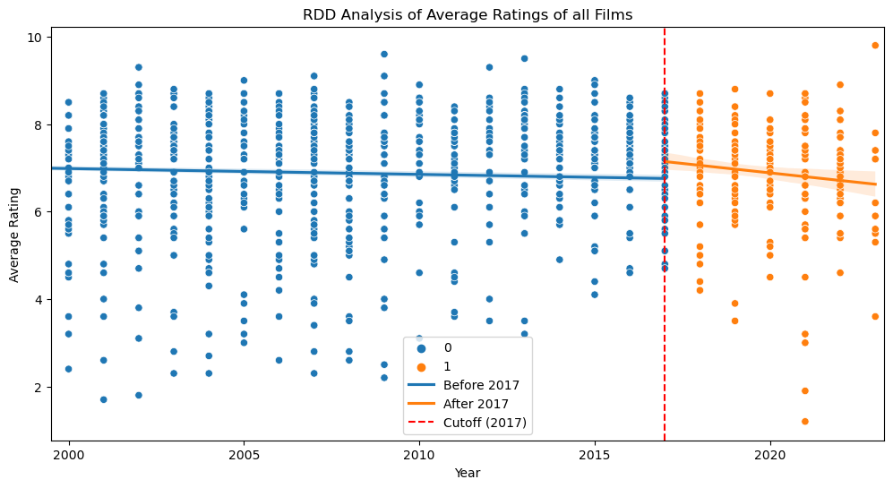
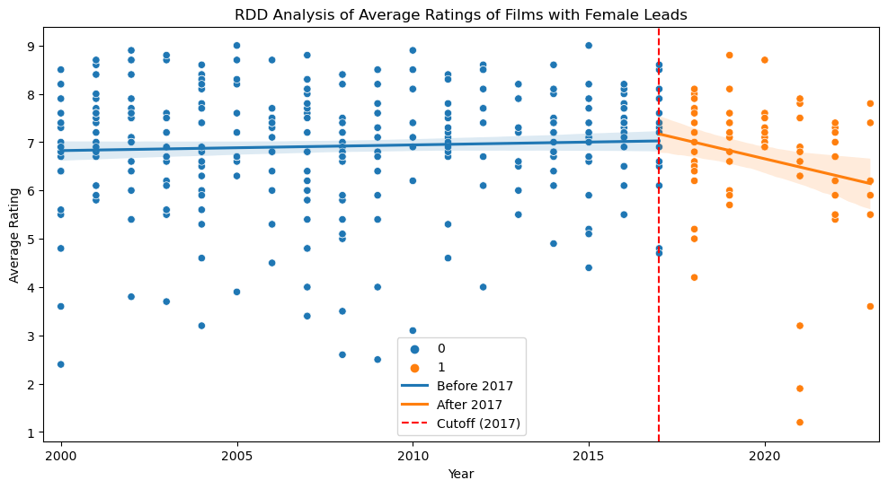

# The Impact of the MeToo Movement on IMDb Ratings

The MeToo movement, initiated in 2006 by Tarana Burke and popularized on social media in 2017 by Alyssa Milano, has been a pivotal force in raising awareness about sexual harassment and assault, particularly in the entertainment industry. This GitHub project aims to analyze the impact of the MeToo movement on IMDb ratings, exploring whether the public's awareness and the subsequent industry changes have influenced the perception and reception of films and television shows.

## Project Overview

The primary goal of this project is to investigate how the MeToo movement has affected IMDb ratings. By analyzing a dataset of IMDb ratings before and after the movement gained widespread attention in 2017, we aim to identify any significant changes in the ratings of productions associated with individuals accused of sexual misconduct versus those that are not. This analysis seeks to understand the broader implications of social movements on public opinion and media consumption.

## Background and Significance

The MeToo movement has had a profound impact on Hollywood, leading to the downfall of numerous high-profile figures and sparking a broader conversation about gender equity and workplace conduct. Studies have shown that the movement has led to tangible changes in the industry, including increased hiring of female writers and a shift in the types of stories being told. However, the movement has also faced criticism and backlash, with concerns about due process and the potential for overcorrection.

Given the entertainment industry's influence on culture and society, it is crucial to examine how these shifts have translated into audience reception. IMDb ratings, as a widely recognized measure of a film or show's popularity and critical reception, provide a valuable lens through which to view these impacts.

## Methodology

Our analysis involves compiling IMDb ratings for a representative sample of productions released before and after 2017, categorized by their association with individuals accused of misconduct in the wake of the MeToo movement. We employ statistical methods to compare the average ratings across these categories, controlling for factors such as genre, budget, and star power to isolate the effect of the MeToo association.

Additionally, we analyze audience reviews and comments to qualitatively assess changes in public sentiment, looking for patterns that may indicate a shift in how viewers engage with content related to the movement.

## Preliminary Findings

Our initial analysis suggests a nuanced impact of the MeToo movement on IMDb ratings. While some productions associated with accused individuals have seen a decline in ratings, others have not experienced significant changes. This variability points to the complex ways in which audiences reconcile their views on art and the artist, as well as the influence of other factors such as the quality of the work itself and the presence of mitigating actions taken by the production to address the accusations.

Furthermore, our review of audience comments reveals a heightened awareness of gender issues and a greater willingness to engage in discussions about the ethical implications of supporting certain productions. This suggests that the MeToo movement has not only influenced industry practices but also shaped viewer consciousness and criteria for evaluating media.

## Conclusion and Future Work

The impact of the MeToo movement on IMDb ratings is multifaceted, reflecting the complex interplay between social movements, industry responses, and public opinion. Our findings contribute to a deeper understanding of how societal shifts influence media consumption and highlight the need for ongoing research in this area.

Future work will expand our dataset, incorporate more sophisticated analytical techniques, and explore additional dimensions of the movement's impact, such as its effect on box office performance and critical acclaim. By continuing to examine these issues, we can gain further insights into the evolving relationship between social justice movements and the entertainment industry.

---